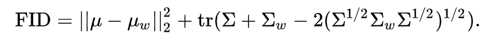

<div align="center">
  
  <h4>DriftLens Demo: Real-time Unsupervised Concept Drift Detection for Deep Learning Models</h4>
</div>
<br/>


*DriftLens* is an **unsupervised drift detection** framework for deep learning classifiers on unstructured data.

This repo contains the code for the DriftLens tool, a web application that allows users to run controlled drift experiments on pre-uploaded use cases or run drift detection on user-provided data.

The Demo has been presented in the following demo paper:

[DriftLens: A Concept Drift Detection Tool](https://openproceedings.org/2024/conf/edbt/paper-239.pdf) **(Greco et al., 2024, Proceedings of the
27th International Conference on Extending Database Technology EDBT)**


The priliminary version of the *DriftLens* methodology was first proposed in the paper:

[Drift Lens: Real-time unsupervised Concept Drift detection by evaluating per-label embedding distributions](https://ieeexplore.ieee.org/document/9679880) **(Greco et al., 2021, International Conference on Data Mining Workshops (ICDMW))**


# Table of Contents
- [DriftLens Methodology](#driftlens-methodology)
  - [Offline Phase](#offline-phase)
  - [Online Phase](#online-phase)
- [DriftLens Tool](#driftlens-tool)
  - [Run controlled drift experiments on pre-uploaded use cases](#1-run-controlled-drift-experiments-on-pre-uploaded-use-cases-page-1)
  - [Run drift detection on user-provided data](#2-run-drift-detection-on-user-provided-data-page-2)
  - [Drift Detection Monitor](#3-drift-detection-monitor-page-3)
- [Setup](#setup)
- [Recorded Demo](#recorded-demo)
- [References](#references)
- [Authors](#authors)

# DriftLens Methodology

You can read more about the *DriftLens* methodology in this [paper](https://ieeexplore.ieee.org/document/9679880).

*DriftLens* is an unsupervised drift detection technique based
on distribution distances within the embedding representations generated by deep learning models when working with unstructured
data. 

The technique is unsupervised and does not require the true
labels in the new data stream. Due to its low complexity, it can
perform drift detection in real time. 

The methodology includes an offline and an online phase, as summarized in the following figure.
However, the data modeling and distribution distances computation are performed in the same way in both phases.


### Data Modeling
A given batch of data is modeled by estimating the multivariate normal distribution of the embedding vectors. Specifically, the distribution is
represented by the embeddings’ mean vector and covariance matrix.

### Distribution Distances
The Frechét Inception Distance (FID) score
is used to compute the distance between two multivariate normal
distributions. 

The  Frechét Inception Distance between two multivariate normal distributions is computed as:


It is a real [0, ∞] range value. The higher the score,
the greater the distance and the more likely the drift.

## Offline Phase
In the *offline* DriftLens estimates the distributions of a historical dataset, called *baseline*, which represents the concepts
that the model has learned during training. It then estimates thresholds that discriminate between normal and abnormal (i.e., possible
drift) distribution distances using a *threshold* dataset. Notice that the *baseline* and *threshold* datasets can be the same.

To this end, the baseline &#x2460; and the threshold &#x2461; data is first feed into the model to extract the embedding vectors and the predicted labels. 

Then, the baseline dataset is used to model the distributions of the baseline &#x2462; (i.e., computing the baseline embeddings’ mean vector and covariance matrix). 
Specifically, the baseline dataset is used to
model the *per-batch* and *per-label* multivariate normal
distributions. 
* The *per-batch* models the entire vector
distributions independently of the class label. The mean and covariance are computed on the entire set of embeddings. 
* For the *per-label*, n normal distributions are estimated, where n is the
number of labels the model was trained on. Each one is modeled by
grouping the embeddings by predicted labels and computing the mean and covariance of each label separately.

To estimate the thresholds &#x2463;, a large number of windows are sampled from the threshold dataset.
The distances  are then calculated between the baseline and each window, and sorted in descending
order. The maximum value represents the
maximum distance of a set of samples considered without drift. This value is set as the threshold.

## Online Phase
In the online phase, DriftLens analyzes the new data stream in
fixed-size windows. For each window, the process is similar to the
offline phase. 

* The embedding vectors and the predicted labels
are produced by the model &#x2464;.
* The *per-batch* and *per-label* distributions are modeled by computing the mean and
covariance of the embedding for the entire window and the samples
predicted for each label separately &#x2465;. 
* The *per-batch* and *per-label* distribution distances between the embeddings of
the current window and the baseline are computed &#x2466;.
* Drift is predicted if the distribution distances exceed the threshold values for the current window &#x2467;.

The process is repeated for each window. A [drift monitor](#3-drift-detection-monitor-page-3) plots
the distribution distances per-batch and per-labels separately over
time. 

# DriftLens Tool
The tool is a web application implemented in Flask based on the DriftLens methodology. 

Within the tool, you can perform two types of experiments: 
1. Run controlled drift experiments on pre-uploaded use cases (Page 1). 
2. Run drift detection on your own data (Page 2).

Both pages run the *online* phase of DriftLens to perform drift detection to understand **if**, **where**, and **how** drift occurs on the controlled or your data streams
by opening the DriftLens drift detection monitor (Page 3).

## 1) Run controlled drift experiments on pre-uploaded use cases (Page 1)

The first page allows you to configure a controlled drift experiment using DriftLens on a set of pre-uploaded use cases.


### Pre-uploaded use cases

<table>
  <caption>Pre-uploaded use cases.</caption>
  <thead>
    <tr>
      <th>Use Case</th>
      <th rowspan="3">Dataset</th>
      <th rowspan="3">Domain</th>
      <th>Models</th>
      <th>F1</th>
      <th rowspan="3">Description</th>
    </tr>
  </thead>
  <tbody>
    <tr>
      <th>1.1</th>
      <td rowspan="3">Ag News</td>
      <td rowspan="3">Text</td>
      <td>BERT</td>
      <td>0.98</td>
      <td rowspan="3"> <b>Task</b>: Topic Classification. <BR>
<b>Training Labels</b>: <i>World</i>, <i>Business</i>, and <i>Sport</i> <BR>
<b>Drift</b>: Simulated with one new class label: <i>Science/Tech</i></td>
    </tr>
    <tr>
      <th>1.2</th>
      <td>DistillBERT</td>
      <td>0.97</td>
    </tr>
    <tr>
      <th>1.3</th>
      <td>RoBERTa</td>
      <td>0.98</td>
    </tr>
    <tr class="separator">
      <td></td>
      <td></td>
      <td></td>
      <td></td>
      <td></td>
      <td></td>
    </tr>
  <tr>
      <th>2.1</th>
      <td rowspan="3">20 Newsgroup</td>
      <td rowspan="3">Text</td>
      <td>BERT</td>
      <td>0.88</td>
      <td rowspan="3"><b>Task</b>: Topic Classification. <BR>
<b>Training Labels</b>: <i>Technology</i>, <i>Sale-Ads</i>, <i>Politics</i>, <i>Religion</i>, <i>Science</i> <BR>
<b>Drift</b>: Simulated with one new class label: <i>Recreation</i></td>
    </tr>
    <tr>
      <th>2.2</th>
      <td>DistillBERT</td>
      <td>0.87</td>
    </tr>
    <tr>
      <th>2.3</th>
      <td>RoBERTa</td>
      <td>0.88</td>
    </tr>
    <tr class="separator">
      <td></td>
      <td></td>
      <td></td>
      <td></td>
      <td></td>
      <td></td>
    </tr>
  <tr>
      <th>3.1</th>
      <td rowspan=2">Intel-Image</td>
      <td rowspan="2">Computer Vision</td>
      <td>VGG16</td>
      <td>0.89</td>
      <td rowspan="2"> <b>Task</b>: Image Classification. <BR>
<b>Training Labels</b>: <i>Forest</i>, <i>Glacier</i>, <i>Mountain</i>, <i>Building</i>, <i>Street</i> <BR>
<b>Drift</b>: Simulated with one new class label: <i>Sea</i></td>
    </tr>
    <tr>
      <th>3.2</th>
      <td>VisionTransformer</td>
      <td>0.90</td>
    </tr>
    <tr class="separator">
      <td></td>
      <td></td>
      <td></td>
      <td></td>
      <td></td>
      <td></td>
    </tr>
  <tr>
      <th>4.1</th>
      <td rowspan="2">STL</td>
      <td rowspan="2">Computer Vision</td>
      <td>VGG16</td>
      <td>0.82</td>
      <td rowspan="2"> <b>Task</b>: Image Classification. <BR>
<b>Training Labels</b>: <i>Airplane</i>, <i>Bird</i>, <i>Car</i>, <i>Cat</i>, <i>Deer</i>, <i>Dog</i>, <i>Horse</i>, <i>Monkey</i>, <i>Ship</i> <BR>
<b>Drift</b>: Simulated with one new class label: <i>Truck</i></td>
    </tr>
    <tr>
      <th>4.2</th>
      <td>VisionTransformer</td>
      <td>0.96</td>
    </tr>
    <tr class="separator">
      <td></td>
      <td></td>
      <td></td>
      <td></td>
      <td></td>
      <td></td>
    </tr>
  </tbody>
</table>

### Data stream generation
For each use case, you can generate a data stream by setting two parameters: the *number of windows*
and the *window size*. A data stream consisting of number of windows will be created, each composed of window size samples.

In the generation of the data stream, you can simulate four types of drift scenarios:


## 2) Run drift detection on user-provided data (Page 2)

The second page allows you to experiment with drift detection on
your data and models.

To this end, you should provide the embedding and predicted labels for the *baseline* and *threshold*
datasets (e.g., training and test set) to
execute the offline phase of DriftLens.
Finally, you should provide an order *data stream* to perform the drift detection.

You can read the correct format for your data [here](#use-your-own-data-to-perform-drift-detection).


## 3) Drift detection monitor (Page 3)
The tool processes each data window in real-time using the DriftLens
methodology. The drift monitor page shows the distribution distances for the entire window (per-batch) and separately per label
in two charts (per-label). The charts are dynamically updated once
DriftLens has processed each window until the end of the data
stream. 


You can use the drift detection monitor to understand: 
- *when* drift occurs by looking at the windows in which drift was predicted;
- *how* drift occurs in terms of severity of the drift and patterns;
- *where* drift occurs by analyzing the labels the most affected by drift.

# Setup
To use the DriftLens tool locally:

### 1) Create and Start a new environment:
```sh
conda create -n driftlens-demo-env python=3.8 anaconda
conda activate driftlens-demo-env
```
### 2) Install the required packages:
```sh
pip install -r requirements.txt
```
### 3) Download the pre-computed embedding in the tool (TODO):
```sh
./download_data.sh 
```

You can also download the zip file manually and replace the 'use_cases' folder in the 'static' folder with the one in the zip file. The zip file can be downloaded from here: 

https://www.dropbox.com/scl/fi/3uezd5qmecfune6d7fruu/use_cases.zip?rlkey=9ei0elx78mkssnkniaf5gnq70&dl=0
### 4) Start the DriftLens app locally:
```sh
python driftlens_app.py
```
The DriftLens app will run on localhost: http://127.0.0.1:5000

### Use your own data to perform drift detection
If you want to perform a drift detection on your own data, you need to provide the following files:
- **baseline_embedding**: the embedding of the baseline dataset (e.g., training set)
- **threshold_embedding**: the embedding of the threshold dataset (e.g., test set or training set)
- **data_stream**: the data stream to be used for drift detection

Each file should be in the HDF5 format and contain the following columns:
- *"E"*: the embedding of the samples in your dataset, as a numpy array of shape (*n_samples*, *embedding_dimension*).
- *"Y_predicted"*: the predicted label ids of the samples in your dataset, as a list of *n_samples* elements.

# Recorded Demo
[](https://www.youtube.com/watch?v=1R2igFhMD8U)


# References
If you use the DriftLens methodology or tool, please cite the following papers:

**DriftLens Methodology**
```bibtex
@INPROCEEDINGS{driftlens,
  author={Greco, Salvatore and Cerquitelli, Tania},
  booktitle={2021 International Conference on Data Mining Workshops (ICDMW)}, 
  title={Drift Lens: Real-time unsupervised Concept Drift detection by evaluating per-label embedding distributions}, 
  year={2021},
  volume={},
  number={},
  pages={341-349},
  doi={10.1109/ICDMW53433.2021.00049}
  }
```
**DriftLens Tool**
```bibtex
UNDER REVIEW
```
# Authors

- **Salvatore Greco**, *Politecnico di Torino* - [Homepage](https://grecosalvatore.github.io/) - [GitHub](https://github.com/grecosalvatore) - [Twitter](https://twitter.com/_salvatoregreco)
- **Bartolomeo Vacchetti**, *Politecnico di Torino* - [Homepage]()
- **Daniele Apiletti**, *Politecnico di Torino* - [Homepage](https://www.polito.it/en/staff?p=daniele.apiletti)
- **Tania Cerquitelli**, *Politecnico di Torino* - [Homepage](https://dbdmg.polito.it/dbdmg_web/people/tania-cerquitelli/)