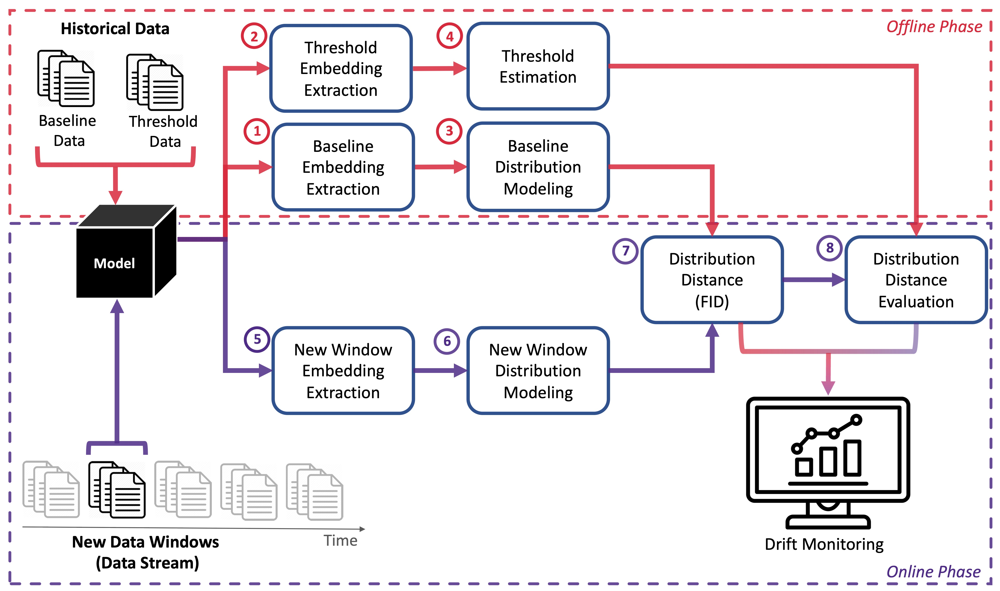
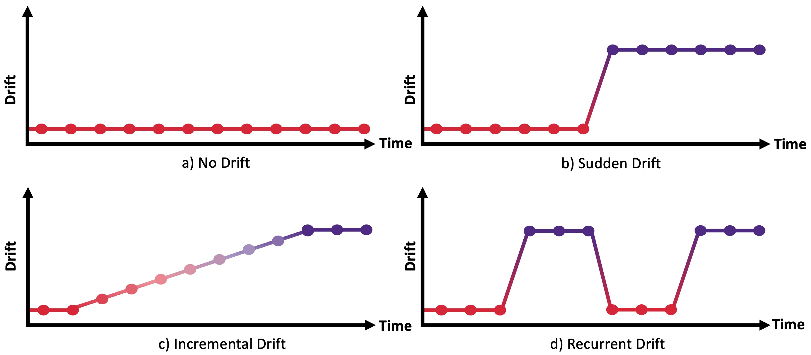

<div align="center">
  
  <h4>DriftLens Demo: Real-time Unsupervised Concept Drift Detection for Deep Learning Models</h4>
</div>
<br/>


*DriftLens* is an **unsupervised drift detection** framework for deep learning classifiers on unstructured data.
It performs distribution distances between a historical dataset, called baseline, and a new data stream divided in fixed-sized windows.

This repo contains the code for the DriftLens tool, a web application which allows users to run controlled drift experiments on pre-uploaded use cases or run drift detection on user-provided data.

# Table of Contents
- [DriftLens Methodology](#methodology)
  - [Offline Phase](#offline-phase)
  - [Online Phase](#online-phase)
- [DriftLens Tool](#driftlens-tool)
  - [Run controlled drift experiments on pre-uploaded use cases](#page1)
  - [Run drift detection on user-provided data](#page2)
  - [Drift Detection Monitor](#page3)
- [Setup](#setup)
- [Recorded Demo](#recorded-demo)
- [References](#references)
- [People Involved](#people-behind-driftlens)

# DriftLens Methodology

The Drift Detection methodology in DriftLens includes two main phases: an *offline* and an *online* phases.

## Offline Phase
The *offline* phase takes as input an historical dataset, called baseline, that represents what the model learned during training. Firstly, the baseline data is feed into the model to extract the embedding vectors and the predicted labels 
&#x2460;. Then, the majority of the baseline dataset is used to model the distributions of the baseline &#x2461;. Instead, a small portion of the baseline data is used to estimate the threshold values &#x2462;
## Online Phase

# DriftLens Tool
The tool is a web application implemented in Flask based on the DriftLens methodology. 

Within the tool, users can perform two types of experiments: 
1. Run controlled drift experiments on pre-uploaded use cases (Page 1). 
2. Run drift detection on user-provided data (Page 2).

Both pages run the *online* phase of DriftLens to perform drift detection to understand **if**, **where**, and **how** drift occurs on the controlled or user-provided data streams
by opening the DriftLens drift detection monitor (Page 3).

## 1) Run controlled drift experiments on pre-uploaded use cases 

The first page allows users to configure a controlled drift experiment using DriftLens on a set of pre-uploaded use cases.


### Pre-uploaded use cases

<table>
  <caption>Pre-uploaded use cases.</caption>
  <thead>
    <tr>
      <th>Use Case</th>
      <th rowspan="3">Dataset</th>
      <th rowspan="3">Domain</th>
      <th>Models</th>
      <th>F1</th>
      <th rowspan="3">Description</th>
    </tr>
  </thead>
  <tbody>
    <tr>
      <th>1.1</th>
      <td rowspan="3">Ag News</td>
      <td rowspan="3">Text</td>
      <td>BERT</td>
      <td>0.98</td>
      <td rowspan="3"> <b>Task</b>: Topic Classification. <BR>
<b>Training Labels</b>: <i>World</i>, <i>Business</i>, and <i>Sport</i> <BR>
<b>Drift</b>: Simulated with one new class label: <i>Science/Tech</i></td>
    </tr>
    <tr>
      <th>1.2</th>
      <td>DistillBERT</td>
      <td>0.97</td>
    </tr>
    <tr>
      <th>1.3</th>
      <td>RoBERTa</td>
      <td>0.98</td>
    </tr>
    <tr class="separator">
      <td></td>
      <td></td>
      <td></td>
      <td></td>
      <td></td>
      <td></td>
    </tr>
  <tr>
      <th>2.1</th>
      <td rowspan="3">20 Newsgroup</td>
      <td rowspan="3">Text</td>
      <td>BERT</td>
      <td>0.88</td>
      <td rowspan="3"><b>Task</b>: Topic Classification. <BR>
<b>Training Labels</b>: <i>Technology</i>, <i>Sale-Ads</i>, <i>Politics</i>, <i>Religion</i>, <i>Science</i> <BR>
<b>Drift</b>: Simulated with one new class label: <i>Recreation</i></td>
    </tr>
    <tr>
      <th>2.2</th>
      <td>DistillBERT</td>
      <td>0.87</td>
    </tr>
    <tr>
      <th>2.3</th>
      <td>RoBERTa</td>
      <td>0.88</td>
    </tr>
    <tr class="separator">
      <td></td>
      <td></td>
      <td></td>
      <td></td>
      <td></td>
      <td></td>
    </tr>
  <tr>
      <th>3.1</th>
      <td rowspan=2">STL</td>
      <td rowspan="2">Computer Vision</td>
      <td>VGG16</td>
      <td>0.89</td>
      <td rowspan="2"> <b>Task</b>: Image Classification. <BR>
<b>Training Labels</b>: <i>Forest</i>, <i>Glacier</i>, <i>Mountain</i>, <i>Building</i>, <i>Street</i> <BR>
<b>Drift</b>: Simulated with one new class label: <i>Sea</i></td>
    </tr>
    <tr>
      <th>3.2</th>
      <td>VisionTransformer</td>
      <td>0.90</td>
    </tr>
    <tr class="separator">
      <td></td>
      <td></td>
      <td></td>
      <td></td>
      <td></td>
      <td></td>
    </tr>
  <tr>
      <th>4.1</th>
      <td rowspan="2">STL</td>
      <td rowspan="2">Computer Vision</td>
      <td>VGG16</td>
      <td>0.82</td>
      <td rowspan="2"> <b>Task</b>: Image Classification. <BR>
<b>Training Labels</b>: <i>Airplane</i>, <i>Bird</i>, <i>Car</i>, <i>Cat</i>, <i>Deer</i>, <i>Dog</i>, <i>Horse</i>, <i>Monkey</i>, <i>Ship</i> <BR>
<b>Drift</b>: Simulated with one new class label: <i>Truck</i></td>
    </tr>
    <tr>
      <th>4.2</th>
      <td>VisionTransformer</td>
      <td>0.96</td>
    </tr>
    <tr class="separator">
      <td></td>
      <td></td>
      <td></td>
      <td></td>
      <td></td>
      <td></td>
    </tr>
  </tbody>
</table>

### Data stream generation
For each use case, the user can generate a data stream by setting two parameters: the *number of windows*
and the *window size*. A data stream consisting of number of windows will be created, each composed of window size samples.

In the generation of the data stream, the user can simulate four types of drift scenarios:




## 2) Run drift detection on user-provided data.

The second page allows users to experiment with drift detection on
their data and models.

To this end, users should provide the embedding and predicted labels for the *baseline* and *threshold*
datasets (e.g., training and test set) to
execute the offline phase of DriftLens.
Then, users should provide an order *data stream* to perform the drift detection.


## 3) Drift detection monitor
The tool processes each data window in real-time using the DriftLens
methodology. The drift monitor page shows the distribution dis-
tances for the entire window (per-batch) and separately per label
in two charts (per-label). The charts are dynamically updated once
DriftLens has processed each window until the end of the data
stream. 


The previous figure shows an example of the drift monitor page for a data
stream generated with a periodic drift pattern. The above chart
shows the per-batch distribution distances for all the windows.
Instead, the bottom one shows the distances separately for each
label. The x-axis reports the timestamps and the window identifiers,
while the distribution distances are in the y-axis. When drift is
detected (i.e., the distribution distance in a given window is above
the threshold), the area under the curve is filled, and a warning is
displayed in the x-tick of the charts.

The drift detection monitor can be used to understand: 
- *when* drift occurs by looking at the windows in which drift was predicted;
- *how* drift occurs in terms of severity of the drift and patterns;
- *where* drift occurs by analyzing the labels the most affected by drift.

# Setup
To use the DriftLens tool locally:

### 1) Create and Start a new environment:
```sh
conda create -n driftlens-demo-env python=3.8 anaconda
conda activate driftlens-demo-env
```
### 2) Install the required packages:
```sh
pip install -r requirements.txt
```
### 3) Download the pre-computed embedding in the tool (TODO):
```sh
./download_data.sh 
```
### 4) Start the DriftLens app locally:
```sh
python driftlens_app.py
```
The DriftLens app will run on localhost: http://127.0.0.1:5000

### Use your own data to perform drift detection
If you want to perform a drift detection on your own data, you need to provide the following files:
- **baseline_embedding**: the embedding of the baseline dataset (e.g., training set)
- **threshold_embedding**: the embedding of the threshold dataset (e.g., test set or training set)
- **data_stream**: the data stream to be used for drift detection

# Recorded Demo
[](https://www.youtube.com/watch?v=1R2igFhMD8U)


# References
```bibtex
@INPROCEEDINGS{driftlens,
  author={Greco, Salvatore and Cerquitelli, Tania},
  booktitle={2021 International Conference on Data Mining Workshops (ICDMW)}, 
  title={Drift Lens: Real-time unsupervised Concept Drift detection by evaluating per-label embedding distributions}, 
  year={2021},
  volume={},
  number={},
  pages={341-349},
  doi={10.1109/ICDMW53433.2021.00049}
  }
```

# Authors

- **Salvatore Greco** - [Homepage](https://grecosalvatore.github.io/) - [GitHub](https://github.com/grecosalvatore) - [Twitter](https://twitter.com/_salvatoregreco)
- **Bartolomeo Vacchetti** - [Homepage]()
- **Daniele Apiletti** - [Homepage]()
- **Tania Cerquitelli** - [Homepage]()